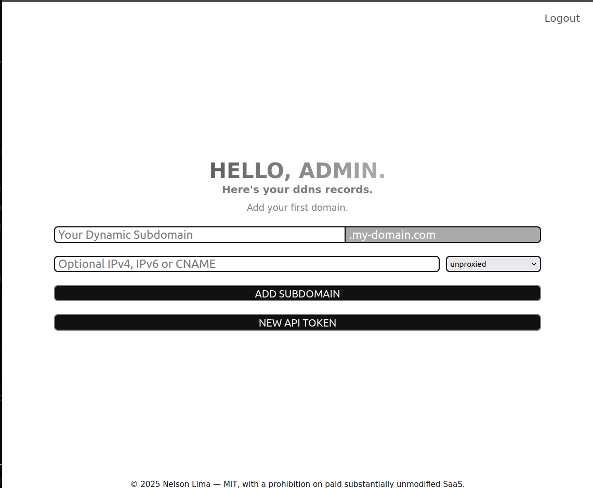

# DDNS_ADMIN

DDNS_ADMIN is a monorepo project that provides a complete platform for managing Dynamic DNS records.  
It includes an admin dashboard, a backend API, background workers, and a lightweight Rust client for synchronizing IP addresses.  
The system is modular and runs through multiple containers, each with a clear responsibility.

<div align="center">
    
</div>

## Architecture

- **app/** → Web admin frontend (Vue 3 + Vite)  
- **api/** → Backend API (Node.js + Express)  
- **client/** → Dynamic DNS client written in Rust  
- **db/** → PostgreSQL database service (stores persistent web sessions and data)  
- **proxy/** → Reverse proxy (currently Nginx)  
- **shared/** → Shared code and utilities across services  
- **workers/** → Background jobs (BullMQ) for domain updates and Cloudflare integration  
- **redis** → Used for BullMQ queues and dynamic client session storage  

All services are containerized, with consistent naming (`ddns_api`, `ddns_app`, `ddns_workers`, `ddns_proxy`, `redis`, etc.).

## Environment Variables

Each service requires environment variables. Below is an example `.env`:

```bash
# API CONFIGURATION
CORS_ORIGIN=https://my-domain.com
SESSION_SECRET=change_this_secret
DOMAIN=ddns.my-domain.com

# CLOUDFLARE
CF_EMAIL=your-cloudflare-account@domain.com
CF_KEY=cloudflare_api_token_here
CF_ZONE_ID=cloudflare_zone_id_here
CF_PROXY=true

# POSTGRES
PGUSER=postgres
PGPASSWORD=supersecret
```


## Running the Project

1. Clone the repository:
   ```bash
   git clone https://github.com/yourusername/DDNS_ADMIN.git
   cd DDNS_ADMIN
   ```

2. Generate TLS certificates (required for the proxy):
   ```bash
   ./generate_ssl_certs.sh
   ```
   You may also provide your own certificates in the expected location.
   ```

3. Start the stack:

   **Development mode**
   ```bash
   npm run dev
   npm run dev:down
   ```

   **Production mode**
   ```bash
   npm run prod
   npm run down
   ```

4. Access the admin dashboard at:  
   [https://localhost](https://localhost)

## Status

- Prototype under active development  
- Core services (API, client, workers, database, Redis, proxy) are functional  
- Documentation and tests are in progress

## License

This project is licensed under the MIT License (with additional SaaS restrictions).  
